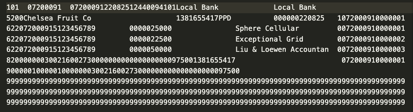

# ACH Generation

For electronic bank transfers, banking institutions require specifically-formatted plain-text files to encode all necessary information. This includes data about the type of payment, the parties, their bank accounts, and payment amounts. These files conform to Automated Clearing House (ACH) standards, which is an electronic-funds transfer system run by the National Automated Clearing House Association (NACHA). ACH files are intended to represent electronic inter-bank transactions.

A Check Run will automatically generate this on demand, but only if the run includes payments using an "Electronic" Mode of Payment. See the [configuration page](./configuration.md) for details on how to set the `Mode of Payment` `type` field to mark it as an electronic bank transfer.

The system defaults to using the "ach" file extension, but you can change this as needed in [Check Run Settings](./settings.md). The settings page also includes options to set two other mandatory fields in an ACH file:

1. **ACH Service Class Code** indicates the types of transactions in the batch. Code 200 is for both debit and credit transactions, code 220 is for only credit transactions, and code 225 is for only debit transactions
2. **ACH Standard Class Code** indicates how the transaction was authorized. Currently, the Check Run application only supports Prearranged Payment and Deposit Entries (code PPD)

Other fields available to help configure your ACH generation include:
- ACH Description, which goes into the Batch header
- Company Discretionary Data, also in the Batch header
- Immediate Origin, which can override the ABA number that the bank is expecting
- Custom Post Processing Hook, which allows you to provide a custom function to further manipulate the ACH file. For example, Royal Bank of Canada requires a non-standard first line.
- Posting Date, which becomes the "Effective Entry Date" in the ACH Batch Header

The 'Custom Post Processing Hook' is a read-only field and not intended to be set by non-technical users. The RBC example noted above can be set by entering the following into the browser console: `cur_frm.set_value('custom_post_processing_hook','check_run.test_setup.example_post_processing_hook')`. Provide the dotted path to your function with a signature matching that of the example.

