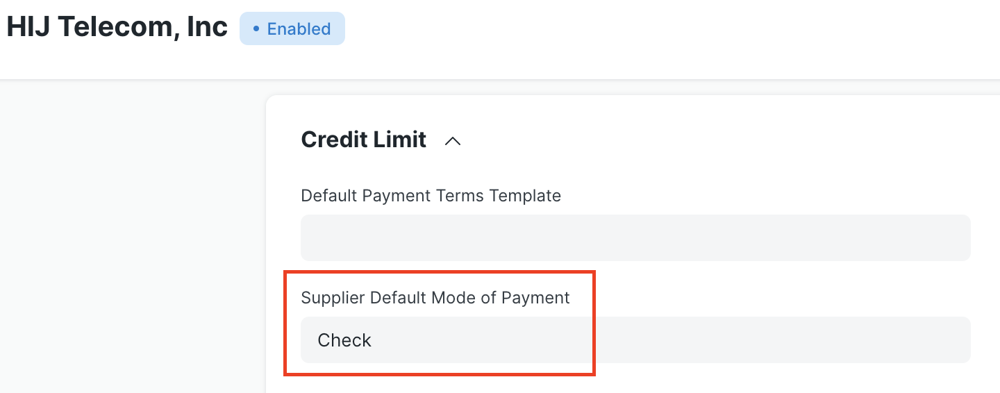
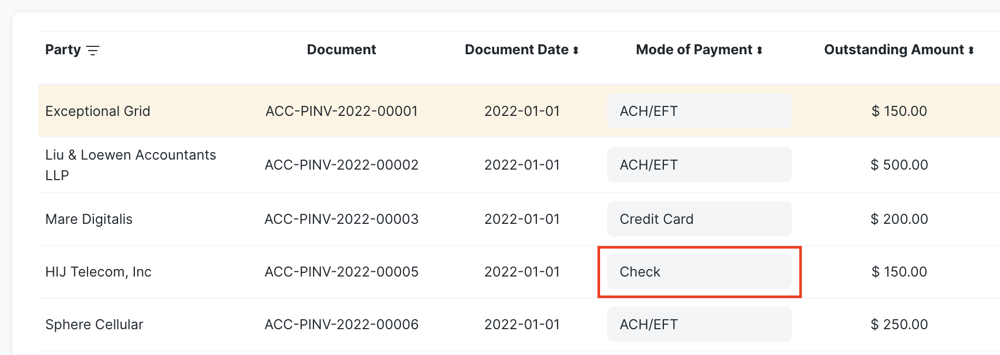
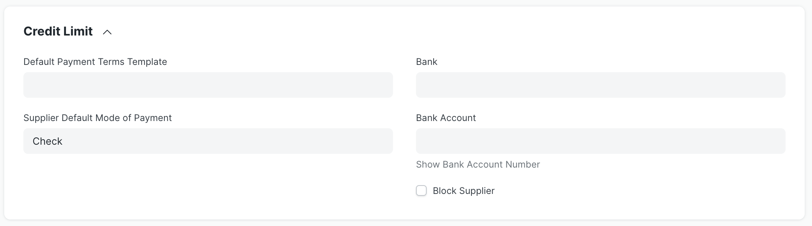

# Configuration

## Banks and Bank Accounts

The check run feature requires at least one `Bank` and `Bank Account` defined for the Company. These can be set up under `Accounting > Bank` and `Accounting > Bank Account`, respectively.

For parties receiving payment via an electronic bank transfer, their `Bank` and `Bank Account` must be in the system as well. See the sections below for configuration details for Suppliers and Employees.

## Mode of Payment

The Check Run application adds a new `type` field into the `Mode of Payment` doctype. The field helps the application properly process different types of payment methods.

For any existing or new `Mode of Payment` document, you can specify one of the following `type` options in the table below. The "Bank" and "Electronic" options are special, and will change the behavior of a check run. Usage suggestions are included with each option.

| Type | Suggested Usage |
|---|---|
| Bank | Payments requiring a physical check |
| Cash | Cash payments |
| Electronic | ACH electronic fund transfers, direct deposit |
| General | Bank drafts, wire transfers, credit cards |
| Phone | Phone payments |

Only Modes of Payment marked as "Electronic" will be included in ACH file generation. This should be reserved for methods like "ACH/EFT" or "Employee Direct Deposit". ACH files are intended to represent electronic inter-bank transactions.

<markdown-tip class="warning" label="Warning">
Only Modes of Payment marked as "Bank" will be included in the Check Print and Reprint features. Bank Drafts and Wire Transfers should not be configured as "Bank" but "General" instead.  
Only Modes of Payment marked as "Electronic" will be included in an ACH file. Credit Cards should not be configured as "Electronic" but should use "General" instead.
</markdown-tip>

## Default Mode of Payment

The options that show in the dropdown for Mode of Payment in a check run are determined by the `Mode of Payment` documents defined in an ERPNext site. The Check Run application includes new fields in the `Supplier` and `Employee` doctypes to specify a default `Mode of Payment`. If populated, this option will automatically show in a check run for any payables owed to that party.

## Supplier Configuration

The `Supplier` doctype has three new fields under the "Credit Limit" section to specify the `Default Supplier Mode of Payment`, `Bank`, and `Bank Account`. As noted above, if there is a value for the `Supplier Default Mode of Payment`, it will automatically show in the check run for any invoices for that supplier.

The `Bank` and `Bank Account` fields are retrieved by the system to facilitate payments when the mode of payment is an electronic type.

## Employee Configuration

Similarly, the `Employee` doctype includes new `Mode of Payment`, `Bank`, and `Bank Account` fields in the "Salary Details" section. The `Mode of Payment` value will show in a check run, and the system uses the `Bank` and `Bank Account` values for electronic payments.

