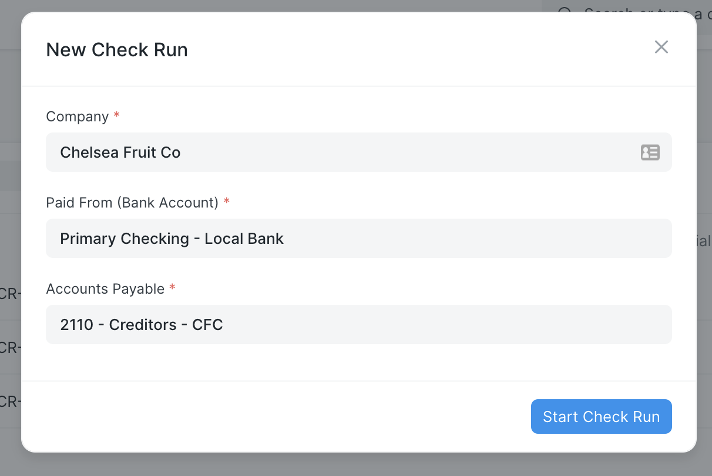
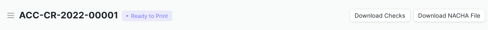

# Check Run Documentation

The Check Run application extends ERPNext[^1] with several payables-related utilities. These include check run (a single-page payment mechanism), check printing, and a bank-friendly report.

The check run feature collects all outstanding payables for a given company and account head. It defaults to returning payables up to the current date, but this can be adjusted as needed. The user then selects the invoices to pay and the payment method. On submission, the form creates payment entries that post against the specified bank account, and gives the user the option to print checks.

## Installation, Configuration, Settings, and Permissions

There is some required prerequisite setup to get the Check Run application up and running on your ERPNext site. See the following pages for details on installation, configuration, settings, and permissions:

- [Installation Guide](./installationguide.md)
- [Configuration: Bank Accounts, Mode of Payment for Employees and Suppliers](./configuration.md)
- [Check Run Settings](./settings.md)
- [Default Permissions and Workflows](./permissions.md)

## Check Run Quick Start

To initiate a check run, search for "Check Run List" in the AwesomeBar, and click the `Add Check Run` button. This opens a dialogue box where the user must select the company, the bank account from which to make the payments, and the payables account head. 

<markdown-tip>
You can add a shortcut to the Check Run list by customizing the Accounts workspace. Instructions are hosted in the ERPNext documentation here: <a href="https://frappeframework.com/docs/v14/user/en/desk/workspace/customization">Desk > Workspace > Customization</a>
</markdown-tip>

The check run then returns a list of all outstanding payables for the given account. The report shows the party, the invoice document name, the outstanding amount, and the due date. This screen also allows the user to edit the parameters of the run as needed, including the end date, the posting date, and the initial check number.

The user checks which payables to pay and the mode of payment for each one. The mode of payment dropdown options will correspond to the `Mode of Payment` documents you have set up in your system. You can configure a default mode of payment for each supplier and employee that will then automatically show as the selection in a check run. 

<markdown-tip>

This view supports the same keyboard shortcuts as the listview in Frappe.

 - The up and down arrows navigate rows
 - The space bar will select or de-select a row to pay
 - Once a row has focus, typing any letter key will auto-complete the Mode of Payment

</markdown-tip>

When the user submits the check run, payment entries are automatically generated for each party. The user is also given the choice to print checks (a print format must be in the system for this to work properly) and save a PDF.

Individual payment entries are linked with a Check Run. You can set the number of invoices paid per voucher to a party in [Check Run Settings](./settings.md).

## Additional Check Run Features

Follow the links below for more information about Check Run's features:

- [ACH Generation](./achgeneration.md)
- [Render PDF Sequence](./renderpdfsequence.md)
- [Positive Pay Report](./positivepay.md)
- [Example Print Format: Voucher Check](./exampleprint.md)
- [Example Data: Experimenting with Check Run Using Demo Data](./exampledata.md)

[^1]: [ERPNext](https://erpnext.com/) is an open-sourced Enterprise Resource Planning (ERP) software that provides a wide range of business management functionality. Its core features include support for accounting, inventory, manufacturing, customer relationship management (CRM), distribution, and retail.
