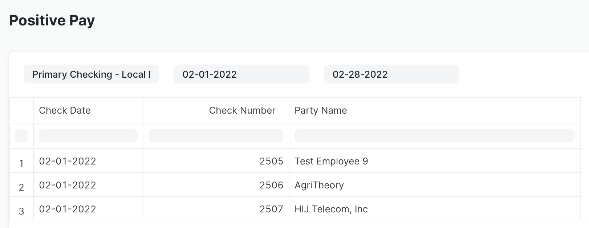

# Positive Pay Report

The check run application includes a new Positive Pay report. This report generates a bank-friendly summary of check payments for a given bank account and period.

To access the report, type "Report Positive Pay" into the AwesomeBar. Enter the bank account, start date, and end date. The report will display a table showing the check date, check number, and party name for all checks against the bank account within the specified time period.

