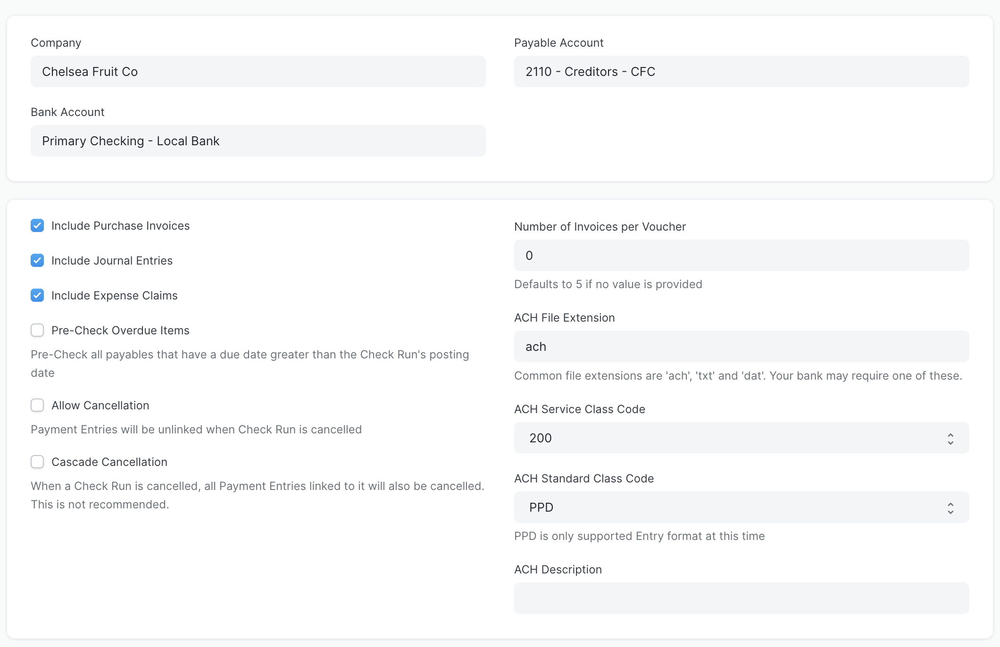

# Check Run Settings

A `Check Run Setting` entry determines the behavior in a Check Run for a specific bank account/payable account combination. You will need to confirm separate settings for every bank account-payable account combination that you plan to use in a Check Run.

If the system doesn't find settings for the account combination you're using in an initiated Check Run, it will automatically take you to the settings page to confirm the options. Alternatively, you can access the setting list directly by searching for "Check Run Settings List" in the AwesomeBar and clicking the `Add Check Run Settings` button.

- **Include Purchase Invoices:**
    - Selected by default
    - Indicates whether or not purchase invoices are included in a Check Run
- **Include Journal Entries:**
    - Selected by default
    - Indicates whether or not journal entries are included in a Check Run. For example, the demo data has a journal entry for payroll taxes owed to the local tax authority - this will only show in a Check Run if this setting is selected
- **Include Expense Claims:**
    - Selected by default
    - Indicates whether or not expense claims are included in a Check Run
    - See the [configuration page](./configuration.md) for instructions on how to set up a default mode of payment, bank, and bank account for an `Employee`
- **Pre-Check Overdue Items:**
    - Unselected by default
    - Indicates whether the "Pay" checkbox is pre-selected for any items whose Due Date falls before the Check Run's Posting Date
- **Allow Cancellation:**
    - Unselected by default
    - Indicates whether or not a user can cancel a Check Run. If selected and a user cancels a Check Run, the system will remove the reference to the Check Run document name in all payment entries that were made via the run, but it will not cancel the payment entries themselves
- **Cascade Cancellation:**
    - Unselected by default (it is not recommended to select this option!)
    - Indicates whether or not the system will cancel all payment entries associated with a Check Run if the Check Run is cancelled
- **Number of Invoices per Voucher:**
    - Default value shows 0, which tells the system this setting is unmodified and it will use 5 invoices per voucher
    - This setting is an upper limit for the number of invoices per party to group into each voucher to that party
    - The screen shot below shows the output of a submitted Check Run where the Number of Invoices per Voucher setting was set to 2. Out of the four invoices paid to Exceptional Grid, they are grouped so two are paid under one voucher, then the other two are paid under a different voucher
- **Split Invoices By Address:**
    - If checked, this will validate if the same vendor is being paid to different addresses and split the payments entries appropriately
- **Automatically Release On Hold Invoices:**
    - By default, on hold invoices will not show if their 'release date' is not within the Check Run period. The checkbox allows invoices that _are_ on hold to be automatically released and paid in the Check Run.

- **ACH File Extension:**
    - Default value is "ach"
    - A Check Run automatically generates an ACH file if any Mode of Payment options used had a type of "Electronic". This setting is a text field to indicate the file extension the system will use when it creates these files. Your banking institution may require a certain extension
    - See the [configuration page](./configuration.md) for instructions on how to indicate a `Mode of Payment` is an electronic bank transfer
- **ACH Service Class Code:**
    - Default is 200
    - Options include 200 (mixed debits and credits), 220 (credits only), and 225 (debits only). This is a mandatory value for fields in the ACH file and should reflect the nature of your electronic bank transfer payments
- **ACH Standard Class Code:**
    - Default is PPD (Prearranged Payment and Deposit Entry)
    - PPD is the only supported standard entry class code at this time
- **ACH Description:**
    - Default is blank
    - Optional field to add a description to ACH files
