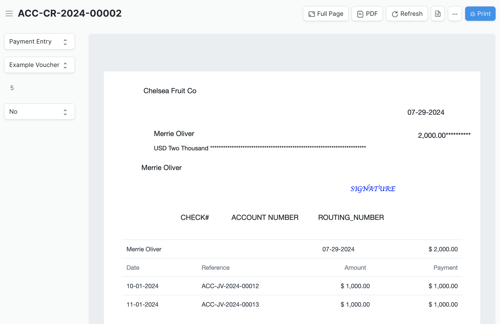
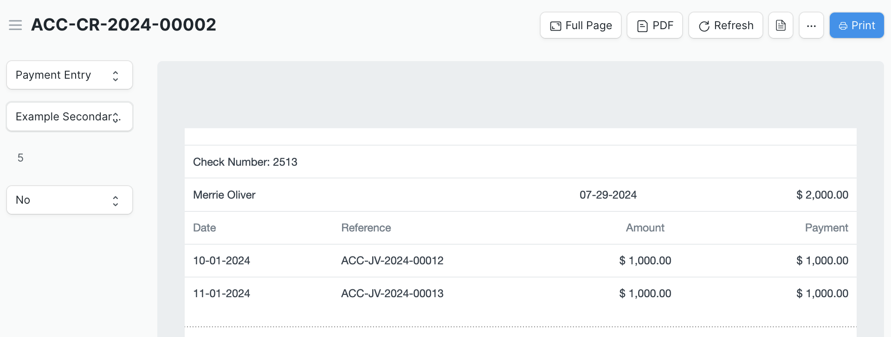

# Example Print Formats: Voucher Check and Summary of References

To take advantage of Check Run's check printing functionality, you'll need to set up a print format in ERPNext. An Example Voucher check print format is provided with the application to serve as a starting point. Print formats are as unique as the organizations using ERPNext, so the example template should be customized to suit your needs. It's enabled by default and can be found in the Print Format list.

A second print format called Example Secondary Print Format is also provided under Print Formats. It's not meant to be used to print checks, but will display a summary of the references associated with each Check.

Both example print formats are set to only display transactions where the Mode of Payment is included in the Printable Modes of Payment in Check Run multiselect field found in Check Run Settings.

One consideration to be aware of if you include references in the print format (like the examples) is that if there are a lot of references associated with a payment, the list may exceed the length of the paper and not print correctly. The value for Number of Invoices per Voucher in Check Run Settings will limit the number of references associated with a payment and can be adjusted as-needed.

Additional resources:

- [ERPNext print format documentation](https://docs.erpnext.com/docs/v14/user/manual/en/customize-erpnext/print-format)

