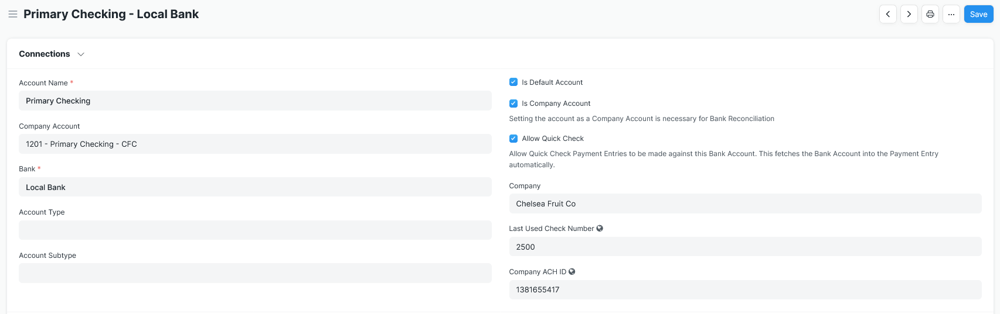

# Payment Entry
## Auto-Increment Check Number
The Check Run application will automatically fetch and increment check numbers, the latest number is stored in the Bank Account doctype. Both Mode of Payment and Company Bank Account are required fields to fetch the data. As long as the number provided is an integer it will save it to the linked Bank Account record.

## Quick Check
This setting on Bank Account automatically fetches the Bank Account into the Payment Entry. This allows for paying a single Purchase Invoice with the normal Create => Payment workflow without selecting any additional information.

## Additional Customizations
Check Run takes the opinion that there is no scenario where it it appropriate to cut a check without providing a reference document. Payment References has been customized to be required unless the Payment Entry is of type 'Internal Transfer'.

Since the Purchase Invoices displayed in a Check Run are automatically split by their Payment Terms (if the invoice has a defined Payment Schedule), it's important that a Payment Entry for a portion of an invoice made outside of a Check Run properly links a Payment Reference to a Payment Term. Check Run includes a validation that attempts to fill this in, and warns the user to review. For more information, refer to the "Considerations for Purchase Invoices with Payment Schedules" section on the [Settings page](./settings.md).

