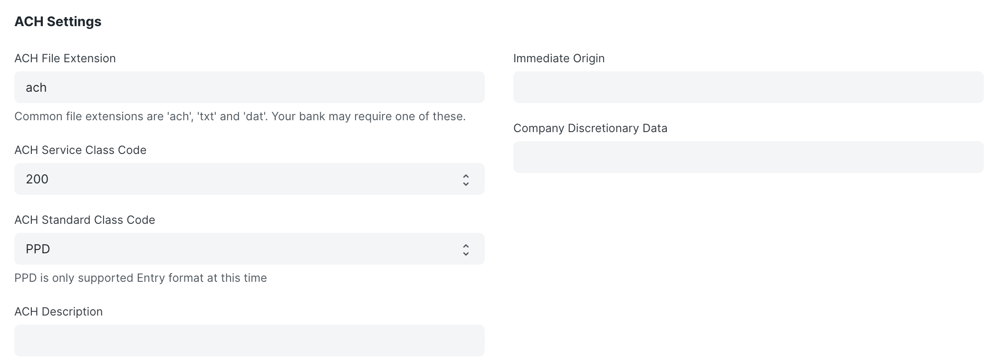
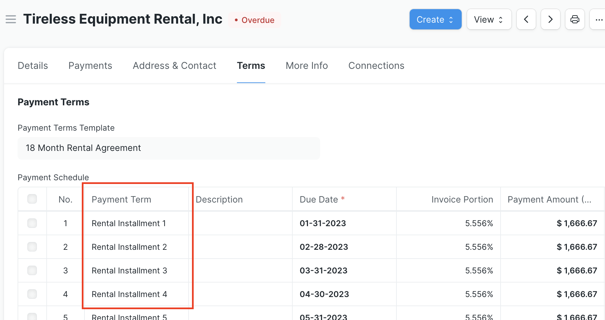
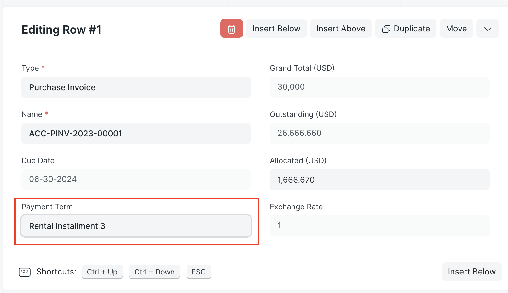

# Check Run Settings

A `Check Run Setting` entry determines the behavior in a Check Run for a specific bank account/payable account combination. You will need to confirm separate settings for every bank account-payable account combination that you plan to use in a Check Run.

If the system doesn't find settings for the account combination you're using in an initiated Check Run, it will automatically take you to the settings page to confirm the options. Alternatively, you can access the setting list directly by searching for "Check Run Settings List" in the AwesomeBar and clicking the `Add Check Run Settings` button.

- **Include Purchase Invoices:**
    - Selected by default
    - Indicates whether or not purchase invoices are included in a Check Run. See below for more information and some considerations around purchase invoices with a payment schedule defined
- **Include Journal Entries:**
    - Selected by default
    - Indicates whether or not journal entries are included in a Check Run. For example, the demo data has a journal entry for payroll taxes owed to the local tax authority - this will only show in a Check Run if this setting is selected
- **Include Expense Claims:**
    - Selected by default
    - Indicates whether or not expense claims are included in a Check Run
    - See the [configuration page](./configuration.md) for instructions on how to set up a default mode of payment, bank, and bank account for an `Employee`
- **Pre-Check Overdue Items:**
    - Unselected by default
    - Indicates whether the "Pay" checkbox is pre-selected for any items whose Due Date falls before the Check Run's Posting Date
- **Allow Cancellation:**
    - Unselected by default
    - Indicates whether or not a user can cancel a Check Run. If selected and a user cancels a Check Run, the system will remove the reference to the Check Run document name in all payment entries that were made via the run, but it will not cancel the payment entries themselves
- **Cascade Cancellation:**
    - Unselected by default (it is not recommended to select this option!)
    - Indicates whether or not the system will cancel all payment entries associated with a Check Run if the Check Run is cancelled
- **Number of Invoices per Voucher:**
    - Default value shows 0, which tells the system this setting is unmodified and it will use 5 invoices per voucher
    - This setting is an upper limit for the number of invoices per party to group into each voucher to that party
    - The screen shot below shows the output of a submitted Check Run where the Number of Invoices per Voucher setting was set to 2. Out of the four invoices paid to Exceptional Grid, they are grouped so two are paid under one voucher, then the other two are paid under a different voucher
    - This can also be set per-Supplier in the "Number  of Invoices Per Check Voucher" field. Per-supplier configuration overrides the number in Check Run Settings
- **Split Invoices By Address:**
    - If checked, this will validate if the same vendor is being paid to different addresses and split the payments entries appropriately
- **Automatically Release On Hold Invoices:**
    - By default, on hold invoices will not show if their 'release date' is not within the Check Run period. The checkbox allows invoices that _are_ on hold to be automatically released and paid in the Check Run.

The Print Settings section covers the print-related options.

- **Print Preview:**
    - The default value is to Automatically Render PDF After Submit, however the Print from Print Preview option allows for viewing and printing using different Print Formats
- **Print Format:**
    - Links to a preferred default Print Format
- **Secondary Print Format:**
    - Links to a backup Print Format
- **Printable Modes of Payment in Check Run:**
    - A collection of the Mode of Payments that are meant to be printed. As detailed in the [configuration page](./configuration.md), this should include the Modes of Payment with the Type "Bank". To see an application of how this is used in a Print Format, see the code in the [Example Voucher](./exampleprint.md) included in Check Run, which only renders payments that have a Mode of Payment included in this list
- **Check formats with background image:**
    - Default is unselected, if this is checked, it allows the user to upload a background image to apply in print preview (see the code in the [Example Voucher](./exampleprint.md) for how this is used)

The next section of settings allow for an optional default Mode of Payment for Purchase Invoices, Expense Claims, and Journal Entries. If there isn't a Mode of Payment specified in the Purchase Invoice, Expense Claim, or Journal Entry itself, and there isn't a default set for the party (see the [Configuration page](./configuration.md) for more details), then this field is used to populate the Mode of Payment column in the Check Run.

There is also a section for all settings related to ACH payments.

- **ACH File Extension:**
    - Default value is "ach"
    - A Check Run automatically generates an ACH file if any Mode of Payment options used had a type of "Electronic". This setting is a text field to indicate the file extension the system will use when it creates these files. Your banking institution may require a certain extension
    - See the [configuration page](./configuration.md) for instructions on how to indicate a `Mode of Payment` is an electronic bank transfer
- **ACH Service Class Code:**
    - Default is 200
    - Options include 200 (mixed debits and credits), 220 (credits only), and 225 (debits only). This is a mandatory value for fields in the ACH file and should reflect the nature of your electronic bank transfer payments
- **ACH Standard Class Code:**
    - Default is PPD (Prearranged Payment and Deposit Entry)
    - PPD is the only supported standard entry class code at this time
- **ACH Description:**
    - Default is blank
    - Optional field to add a description to ACH files

## Considerations for Purchase Invoices with Payment Schedules

One feature of Check Run for purchase invoices with a defined Payment Schedule is it will break out and show separate transactions for each outstanding Payment Term from the Payment Schedule by due date instead of the entire Invoice amount.

The below example assumes one Purchase Invoice for a $30,000 18-month equipment rental that's paid off via a Payment Schedule in 18 equal monthly installments.

Check Run leverages the built-in ERPNext mechanism that automatically updates an invoice's Payment Schedule when a Payment Entry links to a Payment Term in the schedule. There are some ERPNext assumptions and considerations to keep in mind when setting up your Payment Schedules or making Payment Entries against them to ensure this mechanism works properly, both within and outside of a Check Run:

1. For a multi-row Payment Schedule, each row should link to a unique Payment Term. This acts as the "key" to correctly identify the installment in the Payment Schedule that links to the Payment Entry, and update the schedule accordingly.

2. If you're creating a Payment Entry outside of a Check Run that's for a portion of an invoice (to satisfy a Payment Term), there's a validation in place to check for and link to the most recent outstanding Payment Term. If the Payment Term field in the Payment References table is left blank, it attempts to fill in the field and warn the user to review. If the Payment Entry covers multiple Payment Terms, there should be a row for each portion of the payment with a link to its respective Payment Term.

