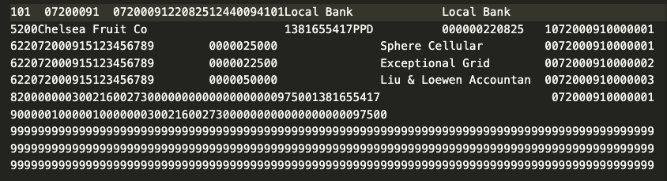

<!-- Copyright (c) 2025, AgriTheory y colaboradores
Para obtener información sobre la licencia, consulte license.txt-->

# Generación de ACH y prenota

Para las transferencias bancarias electrónicas, las instituciones bancarias requieren archivos de texto plano con un formato específico para codificar toda la información necesaria. Esto incluye datos sobre el tipo de pago, las partes, sus cuentas bancarias y los importes de los pagos. Estos archivos cumplen con los estándares de la Cámara de Compensación Automatizada (ACH), un sistema de transferencia electrónica de fondos administrado por la Asociación Nacional de Cámaras de Compensación Automatizada (NACHA). Los archivos ACH están diseñados para representar transacciones electrónicas interbancarias.

## Archivos ACH estándar

Una ejecución de cheque generará esto automáticamente cuando se solicite, pero solo si la ejecución incluye pagos mediante un modo de pago electrónico. Consulte la [página de configuración](./configuration.md) para obtener detalles sobre cómo configurar el campo `tipo` de `Modo de pago` para marcarlo como una transferencia bancaria electrónica.

El sistema usa la extensión de archivo "ach" de forma predeterminada, pero puede cambiarla según sea necesario en [Configuración de Ejecución de Cheque](./settings.md). La página de configuración también incluye opciones para configurar otros dos campos obligatorios en un archivo ACH:

1. **Código de Clase de Servicio ACH** indica los tipos de transacciones del lote. El código 200 es para transacciones de débito y crédito, el código 220 solo para transacciones de crédito y el código 225 solo para transacciones de débito.
2. **Código de Clase Estándar ACH** indica cómo se autorizó la transacción. Actualmente, la aplicación Ejecución de Cheque solo admite Entradas de Pago y Depósito Preacordadas (código PPD).

Otros campos disponibles para configurar la generación de ACH incluyen:
- Descripción de ACH, que se encuentra en el encabezado del lote.
- Datos Discrecionales de la Empresa, también en el encabezado del lote.
- Origen Inmediato, que puede anular el número ABA que el banco espera.
- Gancho de Posprocesamiento Personalizado, que permite proporcionar una función personalizada para manipular aún más el archivo ACH. Por ejemplo, el Royal Bank of Canada requiere una primera línea no estándar.

El campo "Custom Post Processing Hook" es de solo lectura y no está diseñado para usuarios sin conocimientos técnicos. El ejemplo de RBC mencionado anteriormente se puede configurar introduciendo lo siguiente en la consola del navegador: `cur_frm.set_value('custom_post_processing_hook','check_run.test_setup.example_post_processing_hook')`. Proporcione la ruta de puntos a su función con una firma que coincida con la del ejemplo.

## Prenota ACH

Antes de procesar los pagos, los bancos suelen requerir archivos de prenota ACH para validar la información de la cuenta bancaria del destinatario. El informe de prenota ACH permite generar estos archivos de validación con importes de transacción mínimos (normalmente de 0,00 a 0,50 $) para probar las rutas de pago antes de que se realicen las transferencias.

### Códigos de transacción para prenotas

Las prenotas ACH utilizan códigos de transacción específicos para indicar que son transacciones de prueba para la verificación de la cuenta:

| Tipo de cuenta | Código de crédito de prenota | Código de crédito regular | Código de débito de prenota | Código de débito regular |
|-------------|---------------------|---------------------|---------------------|---------------------|
| Cuenta corriente | 23 | 22 | 28 | 27 |
| Cuenta de ahorros | 33 | 32 | 38 | 37 |

Para los proveedores que reciben pagos (créditos), normalmente se utiliza el código **23** para cuentas corrientes o **33** para cuentas de ahorros durante el proceso de prenota.

### Uso del Informe de Prenota ACH

1. Navegue hasta el informe de Prenota ACH en el menú Informes.
2. El informe muestra los destinatarios elegibles para la prueba de prenota ACH.
3. Utilice los filtros del informe para filtrar los destinatarios por grupo de proveedores, condiciones de pago u otros criterios.
4. Haga clic en el botón "Generar Prenota ACH" para crear el archivo de prenota.

### Generación del Archivo de Prenota

Al generar un archivo de prenota ACH, se le solicitará la siguiente información:

- **Configuración de Ejecución de Verificación**: Seleccione el perfil de configuración adecuado para su banco.
- **Importe ACH**: Ingrese el importe de prueba (normalmente $0.50, pero puede variar según el banco).
- **Fecha**: Fecha de vigencia de las transacciones de prenota.

Después de enviar esta información, el sistema generará y descargará un archivo de prenota ACH que puede enviar a su banco.

### Edición de la Información Bancaria desde el Informe de Prenota

Después de enviar el archivo NACHA de prenota a su banco, es posible que reciba comentarios solicitando correcciones. El informe de prenota de ACH le permite:

1. Actualizar la información de la cuenta bancaria del destinatario directamente en la vista del informe.
2. Editar las fechas de vigencia o los importes de la prenota según sea necesario.
3. Regenerar el archivo de prenota con la información corregida.