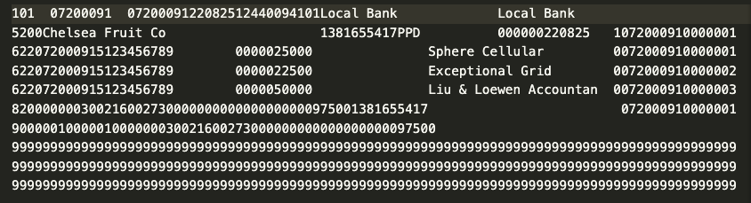

# Generación ACH

Para las transferencias bancarias electrónicas, las instituciones bancarias requieren archivos de texto plano con un formato específico para codificar toda la información necesaria. Esto incluye datos sobre el tipo de pago, las partes, sus cuentas bancarias y los montos del pago. Estos archivos se ajustan a los estándares de la Cámara de Compensación Automatizada (ACH), que es un sistema de transferencia electrónica de fondos administrado por la Asociación Nacional de la Cámara de Compensación Automatizada (NACHA). Los archivos ACH están destinados a representar transacciones interbancarias electrónicas.

Una ejecución de cheque generará esto automáticamente a pedido, pero solo si la ejecución incluye pagos utilizando un modo de pago "electrónico". Consulte la [página de configuración] (./configuration.md) para obtener detalles sobre cómo configurar el campo "tipo" "Modo de pago" para marcarlo como una transferencia bancaria electrónica.

El sistema utiliza de forma predeterminada la extensión de archivo "ach", pero puede cambiarla según sea necesario en [Verificar configuración de ejecución] (./settings.md). La página de configuración también incluye opciones para configurar otros dos campos obligatorios en un archivo ACH:

1. **Código de clase de servicio ACH** indica los tipos de transacciones en el lote. El código 200 es para transacciones de débito y crédito, el código 220 es solo para transacciones de crédito y el código 225 es solo para transacciones de débito.
2. **Código de clase estándar ACH** indica cómo se autorizó la transacción. Actualmente, la aplicación Check Run solo admite pagos y depósitos preestablecidos (código PPD)

Otros campos disponibles para ayudar a configurar su generación ACH incluyen:
- Descripción ACH, que va en el encabezado del lote.
- Datos discrecionales de la empresa, también en el encabezado del lote.
- Origen inmediato, que puede anular el número ABA que espera el banco
- Gancho de posprocesamiento personalizado, que le permite proporcionar una función personalizada para manipular aún más el archivo ACH. Por ejemplo, el Royal Bank of Canada exige una primera línea no estándar.

El 'Enganche de posprocesamiento personalizado' es un campo de solo lectura y no está diseñado para que lo establezcan usuarios sin conocimientos técnicos. El ejemplo de RBC mencionado anteriormente se puede configurar ingresando lo siguiente en la consola del navegador: `cur_frm.set_value('custom_post_processing_hook','check_run.test_setup.example_post_processing_hook')`. Proporcione la ruta de puntos a su función con una firma que coincida con la del ejemplo.

