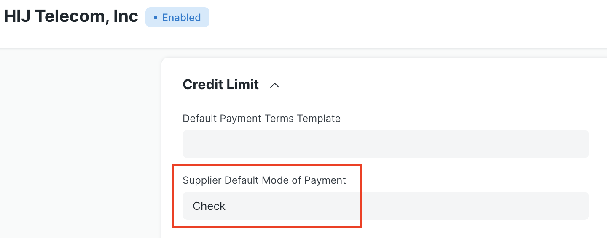
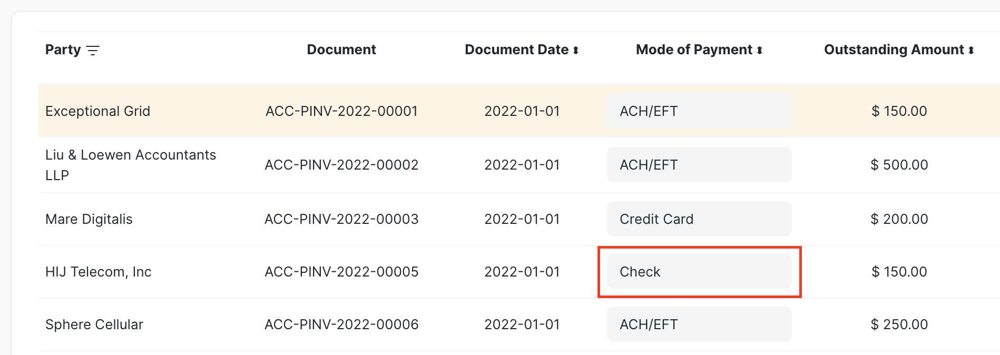
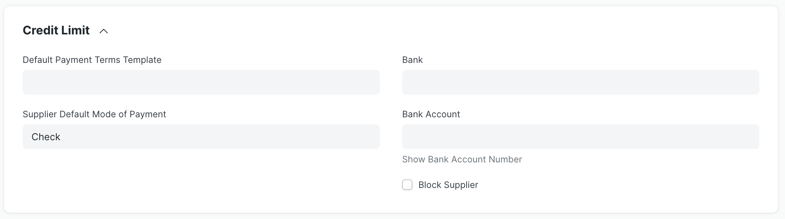
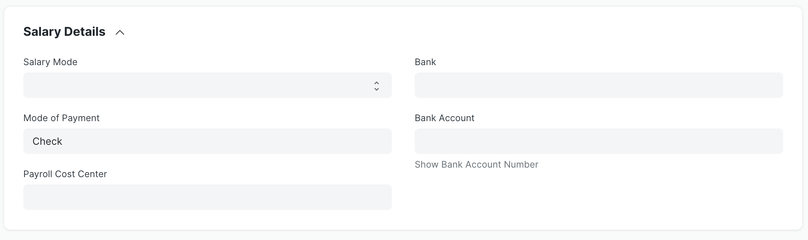

<!-- Copyright (c) 2025, AgriTheory y colaboradores
Para obtener información sobre la licencia, consulte license.txt-->

# Configuración

## Bancos y cuentas bancarias

La función de Ejecución de cheques requiere al menos un "Banco" y una "Cuenta bancaria" definidos para la empresa. Estos se pueden configurar en "Contabilidad > Banco" y "Contabilidad > Cuenta bancaria", respectivamente.

Para quienes reciben pagos mediante transferencia bancaria electrónica, sus "Banco" y "Cuenta bancaria" también deben estar registrados en el sistema. Consulte las secciones a continuación para obtener detalles de configuración para proveedores y empleados.

## Forma de pago

La aplicación Ejecución de cheques añade un nuevo campo "tipo" al doctype "Forma de pago". Este campo ayuda a la aplicación a procesar correctamente los diferentes tipos de métodos de pago.

Para cualquier documento "Forma de pago", ya sea existente o nuevo, puede especificar una de las siguientes opciones de "tipo" en la tabla a continuación. Las opciones "Banco" y "Electrónico" son especiales y modificarán el comportamiento de una Ejecución de cheques. Se incluyen sugerencias de uso con cada opción.

| Tipo | Uso sugerido |
|---|---|
| Banco | Pagos que requieren cheque físico |
| Efectivo | Pagos en efectivo |
| Electrónico | Transferencias electrónicas de fondos ACH, depósito directo |
| General | Giros bancarios, transferencias bancarias, tarjetas de crédito |
| Teléfono | Pagos telefónicos |

Solo los métodos de pago marcados como "Electrónicos" se incluirán en la generación de archivos ACH. Esto debe reservarse para métodos como "ACH/EFT" o "Depósito directo de empleados". Los archivos ACH están diseñados para representar transacciones electrónicas interbancarias.

<markdown-tip class="warning" label="Warning">
Solo los métodos de pago marcados como "Bancos" se incluirán en las funciones de impresión y reimpresión de cheques. Los giros bancarios y las transferencias bancarias no deben configurarse como "Bancos", sino como "Generales".  
Solo los métodos de pago marcados como "Electrónicos" se incluirán en un archivo ACH. Las tarjetas de crédito no deben configurarse como "Electrónicas", sino como "Generales".

## Modo de Pago Predeterminado

Las opciones que se muestran en el menú desplegable "Modo de Pago" en una Ejecución de Cheque se determinan según los documentos de "Modo de Pago" definidos en un sitio ERPNext. La aplicación Ejecución de Cheque incluye nuevos campos en los tipos de documento "Proveedor" y "Empleado" para especificar un "Modo de Pago" predeterminado. Si se completa, esta opción se mostrará automáticamente en una Ejecución de Cheque para cualquier cuenta por pagar a esa parte.

## Configuración del Proveedor

El tipo de documento "Proveedor" incluye tres nuevos campos en la sección "Límite de Crédito" para especificar el "Modo de Pago Predeterminado del Proveedor", "Banco" y "Cuenta Bancaria". Como se mencionó anteriormente, si hay un valor para el "Modo de Pago Predeterminado del Proveedor", este se mostrará automáticamente en la ejecución de cheque para todas las facturas de ese proveedor.

El sistema recupera los campos "Banco" y "Cuenta Bancaria" para facilitar los pagos cuando la forma de pago es electrónica.

## Configuración del Empleado

De igual forma, el doctype "Empleado" incluye los nuevos campos "Forma de Pago", "Banco" y "Cuenta Bancaria" en la sección "Detalles de Salario". El valor de "Forma de Pago" se mostrará en una Ejecución de Cheque, y el sistema utiliza los valores de "Banco" y "Cuenta Bancaria" para los pagos electrónicos.

## Permisos
En las grandes organizaciones, es frecuente que la persona que procesa las cuentas por pagar no sea la misma que imprime o firma los cheques. La función "Ejecución de cheques" facilita esto al requerir que el usuario tenga permisos de "Enviar" para ejecutar "Procesar ejecución de cheques" e "Imprimir" para descargar cheques o archivos ACH.