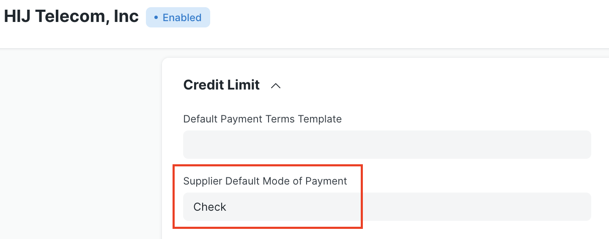

# Configuración

## Bancos y cuentas bancarias

La función Ejecución de cheques requiere al menos un "Banco" y una "Cuenta bancaria" definidos para la Compañía. Estos se pueden configurar en "Contabilidad > Banco" y "Contabilidad > Cuenta bancaria", respectivamente.

Para las partes que reciben el pago mediante transferencia bancaria electrónica, su "Banco" y su "Cuenta bancaria" también deben estar en el sistema. Consulte las secciones siguientes para obtener detalles de configuración para proveedores y empleados.

## Modo de pago

La aplicación Check Run agrega un nuevo campo "tipo" al tipo de documento "Modo de pago". El campo ayuda a la aplicación a procesar adecuadamente diferentes tipos de métodos de pago.

Para cualquier documento de "Modo de pago" existente o nuevo, puede especificar una de las siguientes opciones de "tipo" en la siguiente tabla. Las opciones "Banco" y "Electrónico" son especiales y cambiarán el comportamiento de una ejecución de cheque. Se incluyen sugerencias de uso con cada opción.

| Tipo | Uso sugerido |
|---|---|
| Banco | Pagos que requieren un cheque físico |
| Efectivo | Pagos en efectivo |
| Electrónica | Transferencias electrónicas de fondos ACH, depósito directo |
| Generalidades | Giros bancarios, transferencias bancarias, tarjetas de crédito |
| Teléfono | Pagos telefónicos |

Sólo los modos de pago marcados como "electrónicos" se incluirán en la generación del archivo ACH. Esto debe reservarse para métodos como "ACH/EFT" o "Depósito directo del empleado". Los archivos ACH están destinados a representar transacciones interbancarias electrónicas.

<markdown-tip class="advertencia" etiqueta="Advertencia">
Sólo los modos de pago marcados como "Banco" se incluirán en las funciones de Impresión y Reimpresión de Cheques. Los giros bancarios y las transferencias bancarias no deben configurarse como "Banco", sino como "General".  
Sólo los modos de pago marcados como "electrónicos" se incluirán en un archivo ACH. Las tarjetas de crédito no deben configurarse como "Electrónicas", sino que deben usar "General".
</markdown-tip>

## Modo de pago predeterminado

Las opciones que se muestran en el menú desplegable para Modo de pago en una ejecución de cheque están determinadas por los documentos "Modo de pago" definidos en un sitio ERPNext. La aplicación Check Run incluye nuevos campos en los tipos de documento "Proveedor" y "Empleado" para especificar un "Modo de pago" predeterminado. Si se completa, esta opción se mostrará automáticamente en una ejecución de cheque para cualquier deuda adeudada a esa parte.

## Configuración del proveedor

El tipo de documento "Proveedor" tiene tres campos nuevos en la sección "Límite de crédito" para especificar el "Modo de pago del proveedor predeterminado", "Banco" y "Cuenta bancaria". Como se señaló anteriormente, si hay un valor para el "Modo de pago predeterminado del proveedor", se mostrará automáticamente en la ejecución de verificación para cualquier factura de ese proveedor.

Los campos "Banco" y "Cuenta bancaria" son recuperados por el sistema para facilitar los pagos cuando el modo de pago es de tipo electrónico.

## Configuración de empleado

De manera similar, el tipo de documento "Empleado" incluye nuevos campos "Modo de pago", "Banco" y "Cuenta bancaria" en la sección "Detalles salariales". El valor "Modo de pago" se mostrará en una ejecución de cheque y el sistema utiliza los valores "Banco" y "Cuenta bancaria" para pagos electrónicos.

