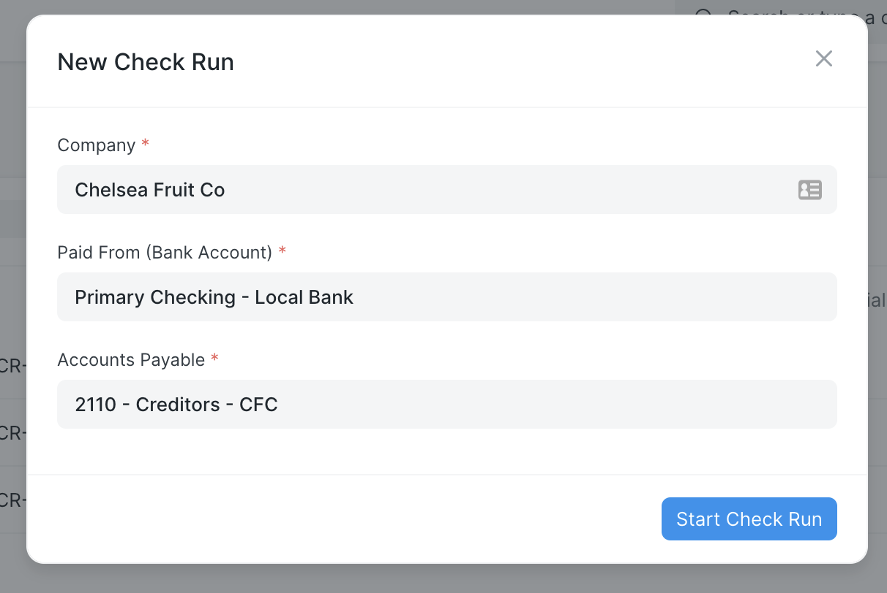
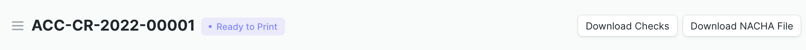

# Verificar la documentación de ejecución

La aplicación Check Run amplía ERPNext[^1] con varias utilidades relacionadas con cuentas por pagar. Estos incluyen Check Run (un mecanismo de pago de una sola página), impresión de cheques y un informe compatible con el banco.

La función Check Run recopila todas las cuentas por pagar pendientes de una empresa y un titular de cuenta determinados. De forma predeterminada, se devuelven las cuentas por pagar hasta la fecha actual, pero esto se puede ajustar según sea necesario. Luego el usuario selecciona las facturas a pagar y el método de pago. Al enviarlo, el formulario crea entradas de pago que se contabilizan en la cuenta bancaria especificada y le da al usuario la opción de imprimir cheques.

## Instalación, configuración, ajustes y permisos

Se requieren algunos requisitos previos de configuración para que la aplicación Check Run esté operativa en su sitio ERPNext. Consulte las siguientes páginas para obtener detalles sobre instalación, configuración, ajustes y permisos:

- [Guía de instalación](./installationguide.md)
- [Configuración: Cuentas Bancarias, Modo de Pago para Empleados y Proveedores](./configuration.md)
- [Verificar configuración de ejecución] (./settings.md)
- [Permisos y flujos de trabajo predeterminados] (./permissions.md)

## Marque Ejecutar inicio rápido

Para iniciar una ejecución de verificación, busque "Lista de ejecución de verificación" en AwesomeBar y haga clic en el botón "Agregar ejecución de verificación". Esto abre un cuadro de diálogo donde el usuario debe seleccionar la empresa, la cuenta bancaria desde la que realizar los pagos y el cabecera de la cuenta a pagar. 

<consejo de rebajas>
Puede agregar un acceso directo a la lista Ejecución de verificación personalizando el espacio de trabajo Cuentas. Las instrucciones están alojadas en la documentación de ERPNext aquí: <a href="https://frappeframework.com/docs/v14/user/en/desk/workspace/customization">Desk > Workspace > Customization</a>
</markdown-tip>

Luego, Check Run devuelve una lista de todas las cuentas por pagar pendientes de la cuenta determinada. El informe muestra la parte, el nombre del documento de la factura, el importe pendiente y la fecha de vencimiento. Esta pantalla también permite al usuario editar los parámetros de la ejecución según sea necesario, incluida la fecha de finalización, la fecha de publicación y el número de cheque inicial.

![Compruebe los parámetros de ejecución y los resultados. El usuario puede editar los campos Fecha de finalización de ejecución de cheque, Fecha de publicación, Número de cheque inicial, Compañía, Pagado desde (cuenta bancaria) y Cuentas por pagar. Se calculan el saldo inicial de la cuenta bancaria, el número de cheque final y el monto en la ejecución del cheque. La tabla muestra una lista de cuentas por pagar pendientes, con columnas para Parte, Documento, Fecha del documento, Modo de pago, Monto pendiente, Fecha de vencimiento y una casilla de verificación para Pagar.](./assets/CheckRunScreen.png)

El usuario consulta qué deudas pagar y la forma de pago de cada una. Las opciones desplegables de modo de pago corresponderán a los documentos "Modo de pago" que haya configurado en su sistema. Puede configurar un modo de pago predeterminado para cada proveedor y empleado que luego se mostrará automáticamente como la selección en una ejecución de verificación.

Si una ejecución de verificación está configurada para incluir facturas de compra (consulte la [página de configuración] (./settings.md) para obtener más detalles), también incluirá cualquier devolución (nota de débito) contra facturas de compra como transacciones separadas. Se puede seleccionar una fila de transacción que muestra el monto devuelto de una determinada parte para "pagar" y usarse para compensar los montos adeudados a otras facturas de la misma parte. El monto total neto de la devolución y otras transacciones para esa parte debe ser superior a cero; una ejecución de cheque no permitirá un pago negativo.

<consejo de rebajas>

Esta vista admite los mismos atajos de teclado que la vista de lista en Frappe.

 - Las flechas arriba y abajo navegan por las filas
 - La barra espaciadora seleccionará o deseleccionará una fila para pagar
 - Una vez que una fila tiene foco, al escribir cualquier letra se completará automáticamente el modo de pago.

</markdown-tip>

Cuando el usuario envía la ejecución del cheque, las entradas de pago se generan automáticamente para cada parte. El usuario también tiene la opción de imprimir cheques (debe haber un formato de impresión en el sistema para que esto funcione correctamente) y guardar un PDF. En la Versión 14, ERPNext actualizará el nuevo Libro mayor de pagos para mostrar también el pago.

Las entradas de pago individuales están vinculadas con una ejecución de cheque. Puede configurar la cantidad de facturas pagadas por comprobante a una parte en [Comprobar configuración de ejecución] (./settings.md).

## Funciones adicionales de ejecución de verificación

Siga los enlaces a continuación para obtener más información sobre las funciones de Check Run:

- [Comprobación rápida/Personalizaciones de entrada de pago] (./pago_entry.md)
- [Generación ACH](./achgeneración.md)
- [Renderizar secuencia PDF](./renderpdfsequence.md)
- [Informe de pago positivo] (./positivepay.md)
- [Ejemplo de formato de impresión: cheque de comprobante] (./exampleprint.md)
- [Datos de ejemplo: Experimentar con Check Run usando datos de demostración](./exampledata.md)
- [Traducciones](./translations.md)

[^1]: [ERPNext](https://erpnext.com/) es un software de planificación de recursos empresariales (ERP) de código abierto que proporciona una amplia gama de funciones de gestión empresarial. Sus características principales incluyen soporte para contabilidad, inventario, fabricación, gestión de relaciones con el cliente (CRM), distribución y venta minorista.

