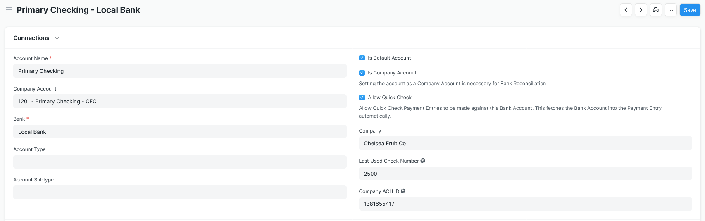

# Entrada de pago
## Número de cheque de incremento automático
La aplicación Check Run buscará e incrementará automáticamente los números de cheque; el último número se almacena en el tipo de documento de la cuenta bancaria. Tanto el Modo de pago como la Cuenta bancaria de la empresa son campos obligatorios para obtener los datos. Siempre que el número proporcionado sea un número entero, lo guardará en el registro de la cuenta bancaria vinculada.

## Comprobación rápida
Esta configuración en Cuenta bancaria recupera automáticamente la Cuenta bancaria en la Entrada de pago. Esto permite pagar una única Factura de Compra con el flujo de trabajo normal Crear => Pago sin seleccionar ninguna información adicional.

## Personalizaciones adicionales
Check Run considera que no existe ningún caso en el que sea apropiado emitir un cheque sin proporcionar un documento de referencia. Las referencias de pago se han personalizado para que sean obligatorias a menos que la entrada de pago sea del tipo "Transferencia interna".

Dado que las Facturas de Compra que se muestran en una Ejecución de Cheque se dividen automáticamente por sus Condiciones de Pago (si la factura tiene un Programa de Pago definido), es importante que una Entrada de Pago para una parte de una factura realizada fuera de una Ejecución de Cheque vincule adecuadamente una Referencia de Pago. a un Plazo de Pago. Check Run incluye una validación que intenta completar esto y advierte al usuario que revise. Para obtener más información, consulte la sección "Consideraciones para facturas de compra con cronogramas de pago" en la [página de configuración] (./settings.md).
