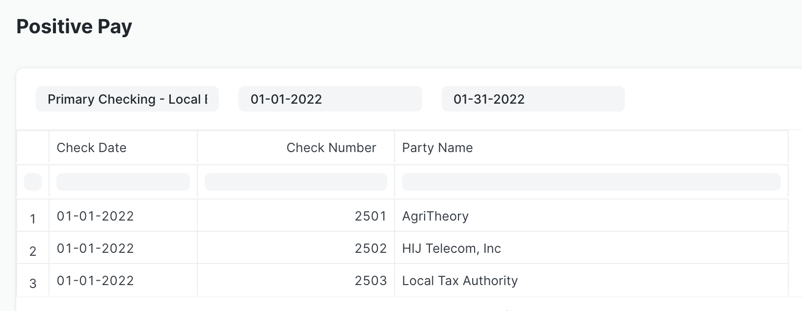

# Informe de pago positivo

La aplicación Check Run incluye un nuevo informe de Pago Positivo. Este informe genera un resumen amigable para los bancos de los pagos de cheques para una cuenta bancaria y un período determinados.

Para acceder al informe, escriba "Reportar pago positivo" en AwesomeBar. Ingrese la cuenta bancaria, la fecha de inicio y la fecha de finalización. El informe mostrará una tabla que muestra la fecha del cheque, el número de cheque y el nombre de la parte de todos los cheques contra la cuenta bancaria dentro del período de tiempo especificado.

