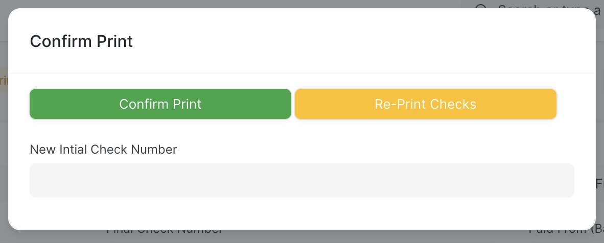

# Renderizar secuencia PDF

Una vez enviada una ejecución de cheque, comenzará a generar los cheques que necesita imprimir. Incluso en sistemas potentes, la realización de comprobaciones puede tardar varios minutos. Check Run crea una nueva carpeta en el Administrador de archivos para archivos PDF. Estos se vincularán a la ejecución de verificación, pero se eliminarán cuando el usuario confirme que han impreso correctamente.

