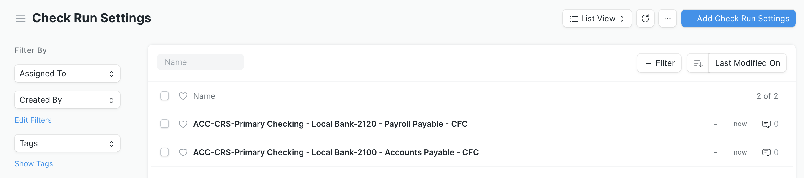
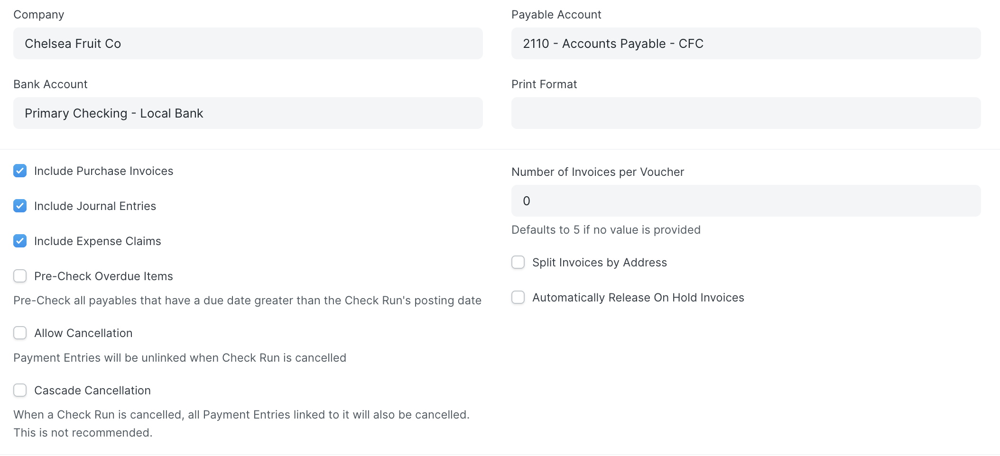
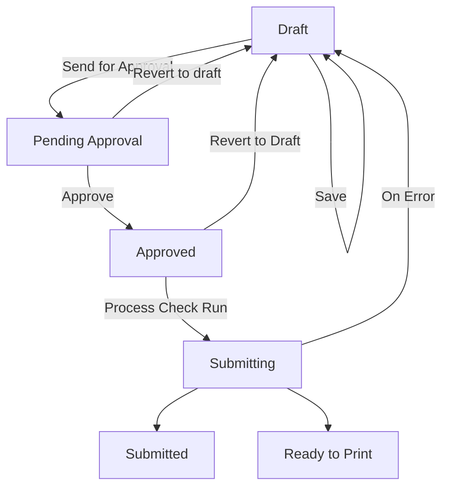
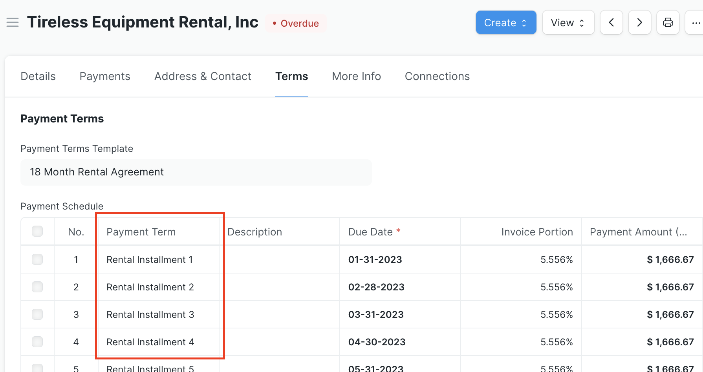

<!-- Copyright (c) 2025, AgriTheory y colaboradores
Para obtener información sobre la licencia, consulte license.txt-->

# Ajustes de la Ejecución de Cheque

La entrada "Ajustes de la Ejecución de Cheque" determina el comportamiento de una Ejecución de Cheque para una combinación específica de cuenta bancaria/cuenta por pagar. Deberá confirmar ajustes por separado para cada combinación de cuenta bancaria/cuenta por pagar que planee usar en una Ejecución de Cheque.

Si el sistema no encuentra los ajustes para la combinación de cuentas que está usando en una Ejecución de Cheque iniciada, lo redirigirá automáticamente a la página de ajustes para confirmar las opciones. También puede acceder directamente a la lista de ajustes buscando "Lista de Ajustes de la Ejecución de Cheque" en AwesomeBar y haciendo clic en el botón "Añadir Ajustes de la Ejecución de Cheque".

- **Rol del aprobador:**
- Si las ejecuciones de cheques requieren la aprobación de otro usuario, se debe indicar su rol aquí.

```mermaid
graph TD
  A[Draft] -- Send for Approval --> B[Pending Approval]
  A -- Save --> A
  B -- Approve --> C[Approved]
  B -- Revert to draft --> A
  C -- Revert to Draft --> A
  C -- Process Check Run --> D[Submitting]
  D -- On Error --> A
  D --> E[Submitted]
  D --> F[Ready to Print]
```

- **Incluir facturas de compra:**
- Seleccionado por defecto
- Indica si las facturas de compra se incluyen en una ejecución de cheques. Consulte a continuación para obtener más información y algunas consideraciones sobre las facturas de compra con un calendario de pagos definido.
- **Incluir asientos de diario:**
- Seleccionado por defecto
- Indica si los asientos de diario se incluyen en una ejecución de cheques. Por ejemplo, los datos de demostración tienen una entrada de diario para los impuestos sobre la nómina adeudados a la autoridad fiscal local. Esto solo se mostrará en una ejecución de cheque si esta opción está seleccionada.
- **Incluir reclamaciones de gastos:**
- Seleccionado por defecto
- Indica si las reclamaciones de gastos se incluyen en una ejecución de cheque.
- Consulte la [página de configuración](./configuration.md) para obtener instrucciones sobre cómo configurar un método de pago, un banco y una cuenta bancaria predeterminados para un "Empleado".
- **Pre-chequear partidas vencidas:**
- No seleccionado por defecto
- Indica si la casilla "Pagar" está preseleccionada para cualquier partida cuya fecha de vencimiento sea anterior a la fecha de contabilización de la ejecución de cheque.
- **Permitir cancelación:**
- No seleccionado por defecto
- Indica si un usuario puede cancelar una ejecución de cheque. Si se selecciona esta opción y un usuario cancela una Ejecución de Cheque, el sistema eliminará la referencia al nombre del documento de la Ejecución de Cheque en todos los asientos de pago realizados mediante la ejecución, pero no cancelará los asientos de pago en sí.
- **Cancelación en Cascada:**
- No seleccionada por defecto (¡no se recomienda seleccionar esta opción!)
- Indica si el sistema cancelará todos los asientos de pago asociados a una Ejecución de Cheque si esta se cancela.
- **Número de Facturas por Comprobante:**
- El valor predeterminado es 0, lo que indica que el sistema no modifica esta configuración y que utilizará 5 facturas por comprobante.
- Esta configuración establece un límite máximo para el número de facturas por parte que se pueden agrupar en cada comprobante para esa parte.
- La siguiente captura de pantalla muestra el resultado de una Ejecución de Cheque enviada con el número de facturas por comprobante establecido en 2. De las cuatro facturas pagadas a Exceptional Grid, se agrupan de modo que dos se pagan con un comprobante y las otras dos con otro.
- Esto también se puede configurar. Por proveedor en el campo "Número de facturas por comprobante de cheque". La configuración por proveedor anula el número en la configuración de la ejecución de cheque.
- **Formato de impresión secundario:**
- Permite que los pagos con más del número de facturas divididas configurado se impriman en cascada en un formato de impresión independiente que detalla todos los documentos vinculados.
- **Dividir facturas por dirección:**
- Si se marca esta opción, se validará si se paga al mismo proveedor a diferentes direcciones y se dividirán los asientos de pago correctamente.
- **Liberar automáticamente facturas en espera:**
- De forma predeterminada, las facturas en espera no se mostrarán si su fecha de liberación no está dentro del período de la ejecución de cheque. La casilla de verificación permite que las facturas en espera se liberen y paguen automáticamente en la ejecución de cheque.
- **Establecer fecha de contabilización de la entrada de pago:**
- De forma predeterminada, la ejecución de cheque utilizará la fecha de hoy para determinar la contabilización en las entradas de pago. Al cambiar esta configuración, puede retroceder o adelantar la fecha. La fecha de referencia en el Asiento de Pago siempre utiliza la fecha de contabilización de la Ejecución de Cheque. Cualquiera de estos campos se puede utilizar en sus formatos de impresión personalizados.

La siguiente sección de configuración permite configurar un Modo de Pago predeterminado opcional para Facturas de Compra, Recibos de Gastos y Asientos de Diario. Si no se especifica una forma de pago en la factura de compra, el informe de gastos o el asiento de diario, ni se ha establecido una configuración predeterminada para la parte (consulte la página [Configuración](./configuration.md) para obtener más información), este campo se utiliza para rellenar la columna "Forma de pago" en la ejecución de cheque.

También hay una sección para todas las configuraciones relacionadas con los pagos ACH.

Captura de pantalla que muestra la sección "Configuración de ACH". A continuación, se incluye una descripción de cada configuración y su valor predeterminado.

- **Extensión de archivo ACH:**
- El valor predeterminado es "ach"
- Una ejecución de cheque genera automáticamente un archivo ACH si alguna de las opciones de forma de pago utilizadas es de tipo "Electrónico". Esta configuración es un campo de texto que indica la extensión de archivo que el sistema usará al crear estos archivos. Su entidad bancaria podría requerir una extensión específica.
- Consulte la [página de configuración](./configuration.md) para obtener instrucciones sobre cómo indicar que un «Modo de Pago» es una transferencia bancaria electrónica.
- **Código de Clase de Servicio ACH:**
- El valor predeterminado es 200.
- Las opciones incluyen 200 (débitos y créditos combinados), 220 (solo créditos) y 225 (solo débitos). Este es un valor obligatorio para los campos del archivo ACH y debe reflejar la naturaleza de sus pagos mediante transferencia bancaria electrónica.
- **Código de Clase Estándar de ACH:**
- El valor predeterminado es PPD (Entrada de Pago y Depósito Preacordado)
- PPD es el único código de clase de entrada estándar admitido actualmente.
- **Descripción de ACH:**
- El valor predeterminado es en blanco
- Campo opcional para agregar una descripción a los archivos ACH

## Consideraciones para Facturas de Compra con Calendario de Pagos

Una característica de la Ejecución de Cheques para facturas de compra con un Calendario de Pagos definido es que desglosará y mostrará transacciones separadas para cada Plazo de Pago pendiente del Calendario de Pagos por fecha de vencimiento, en lugar del importe total de la factura.

El siguiente ejemplo asume una Factura de Compra por un alquiler de equipo de $30,000 a 18 meses que se paga mediante un Calendario de Pagos en 18 cuotas mensuales iguales.

¡Captura de pantalla de las transacciones de una Ejecución de Cheques para Tireless Equipment Rental, Inc. desde principios de año hasta mayo! Muestra transacciones separadas para cada mes por $1,666.67 cada una, lo que refleja los pagos mensuales vencidos en el Calendario de Pagos.](./assets/PaymentScheduleTransactions.png)

La Ejecución de Cheques aprovecha el mecanismo integrado de ERPNext, que actualiza automáticamente el Calendario de Pagos de una factura cuando una Entrada de Pago se vincula a una Condición de Pago en el calendario. Hay algunas suposiciones y consideraciones de ERPNext que se deben tener en cuenta al configurar los Calendarios de Pagos o al realizar Entradas de Pago en ellos para garantizar que este mecanismo funcione correctamente, tanto dentro como fuera de una Ejecución de Cheques:

1. Para un Calendario de Pagos de varias filas, cada fila debe vincularse a una Condición de Pago única. Esto actúa como la clave para identificar correctamente la cuota en el Calendario de Pagos que se vincula a la Entrada de Pago y actualizar el calendario en consecuencia.

2. Si crea una Entrada de Pago fuera de una Ejecución de Cheque, correspondiente a una parte de una factura (para cumplir con una Condición de Pago), existe una validación para verificar y enlazar con la Condición de Pago pendiente más reciente. Si el campo "Término de Pago" de la tabla "Referencias de Pago" se deja en blanco, se intenta completar el campo y se avisa al usuario para que lo revise. Si la Entrada de Pago abarca varias Condiciones de Pago, debe haber una fila para cada parte del pago con un enlace a su respectiva Condición de Pago.

![Captura de pantalla del cuadro de diálogo del formulario al editar una fila en la tabla "Referencias de Pago". El campo "Término de Pago" muestra el valor "Cuota de Alquiler 3" para vincular el importe asignado al plazo correspondiente en el Calendario de Pagos de la factura.