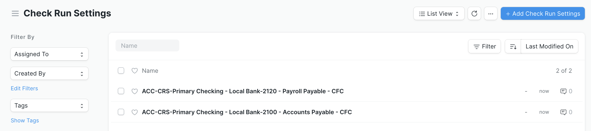
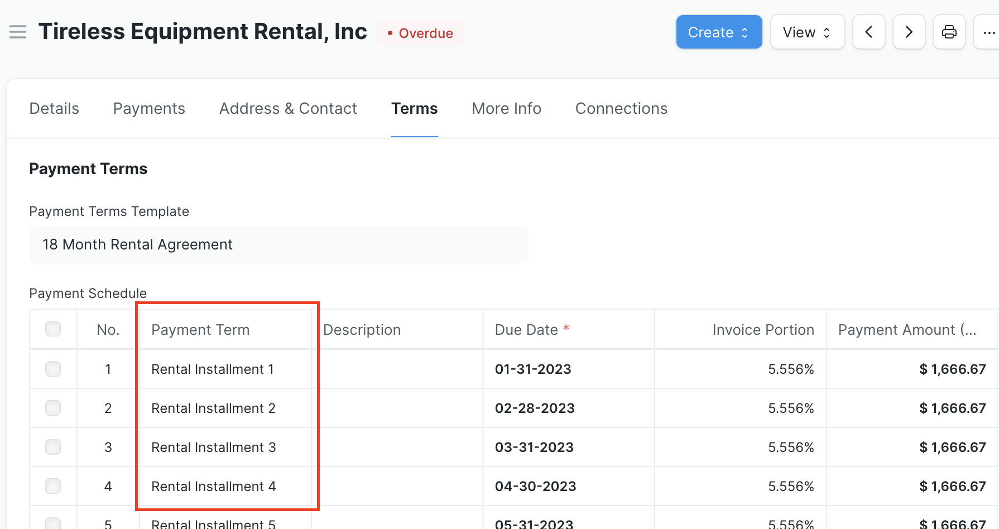

# Verifique la configuración de ejecución

Una entrada "Configuración de ejecución de cheque" determina el comportamiento en una ejecución de cheque para una combinación específica de cuenta bancaria/cuenta por pagar. Deberá confirmar configuraciones separadas para cada combinación de cuenta bancaria y cuenta por pagar que planee usar en una ejecución de cheque.

Si el sistema no encuentra la configuración para la combinación de cuentas que está utilizando en una ejecución de verificación iniciada, lo llevará automáticamente a la página de configuración para confirmar las opciones. Alternativamente, puede acceder a la lista de configuraciones directamente buscando "Verificar lista de configuraciones de ejecución" en AwesomeBar y hacer clic en el botón "Agregar configuraciones de verificación de ejecución".

- **Incluir facturas de compra:**
    - Seleccionado por defecto
    - Indica si las facturas de compra están incluidas o no en una Ejecución de Verificación. Consulte a continuación para obtener más información y algunas consideraciones sobre las facturas de compra con un calendario de pagos definido.
- **Incluir entradas de diario:**
    - Seleccionado por defecto
    - Indica si los asientos de diario se incluyen o no en una ejecución de verificación. Por ejemplo, los datos de demostración tienen un asiento de diario para los impuestos sobre la nómina adeudados a la autoridad tributaria local; esto solo se mostrará en una ejecución de verificación si se selecciona esta configuración.
- **Incluir reclamaciones de gastos:**
    - Seleccionado por defecto
    - Indica si los reclamos de gastos están incluidos o no en una ejecución de verificación.
    - Consulte la [página de configuración](./configuration.md) para obtener instrucciones sobre cómo configurar un modo de pago predeterminado, un banco y una cuenta bancaria para un "Empleado".
- **Verificación previa de artículos vencidos:**
    - No seleccionado por defecto
    - Indica si la casilla de verificación "Pagar" está preseleccionada para cualquier artículo cuya fecha de vencimiento sea anterior a la fecha de publicación de la ejecución del cheque.
- **Permitir cancelación:**
    - No seleccionado por defecto
    - Indica si un usuario puede cancelar o no una ejecución de verificación. Si se selecciona y un usuario cancela una ejecución de cheque, el sistema eliminará la referencia al nombre del documento de ejecución de cheque en todas las entradas de pago que se realizaron a través de la ejecución, pero no cancelará las entradas de pago en sí.
- **Cancelación en cascada:**
    - No seleccionado de forma predeterminada (¡no se recomienda seleccionar esta opción!)
    - Indica si el sistema cancelará o no todas las entradas de pago asociadas con una ejecución de cheque si se cancela la ejecución de cheque.
- **Número de Facturas por Vale:**
    - El valor predeterminado muestra 0, lo que le indica al sistema que esta configuración no se modifica y utilizará 5 facturas por comprobante.
    - Esta configuración es un límite superior para la cantidad de facturas por parte que se agruparán en cada comprobante para esa parte.
    - La siguiente captura de pantalla muestra el resultado de una ejecución de verificación enviada donde la configuración del Número de facturas por comprobante se estableció en 2. De las cuatro facturas pagadas a Exceptional Grid, se agrupan de modo que dos se pagan con un comprobante y luego con el otro. dos se pagan con un bono diferente
    - Esto también se puede configurar por Proveedor en el campo "Número de facturas por comprobante de cheque". La configuración por proveedor anula el número en Comprobar configuración de ejecución
- **Dividir facturas por dirección:**
    - Si está marcado, esto validará si se le paga al mismo proveedor en diferentes direcciones y dividirá las entradas de pagos de manera adecuada.
- **Liberar automáticamente facturas en espera:**
    - De forma predeterminada, las facturas retenidas no se mostrarán si su "fecha de lanzamiento" no está dentro del período de ejecución de verificación. La casilla de verificación permite que las facturas que _están_ en espera se liberen y paguen automáticamente en la ejecución de verificación.

La sección Configuración de impresión cubre las opciones relacionadas con la impresión.

- **Vista previa de impresión:**
    - El valor predeterminado es Renderizar PDF automáticamente después del envío; sin embargo, la opción Imprimir desde vista previa de impresión permite ver e imprimir usando diferentes formatos de impresión.
- **Formato de impresión:**
    - Enlaces a un formato de impresión predeterminado preferido
- **Formato de impresión secundario:**
    - Enlaces a un formato de impresión de respaldo
- **Modos de pago imprimibles en ejecución de cheques:**
    - Una colección de los Modos de Pago que se pretende imprimir. Como se detalla en la [página de configuración](./configuration.md), esta debe incluir los Modos de Pago con el Tipo "Banco". Para ver una aplicación de cómo se usa esto en un formato de impresión, consulte el código en [Vale de ejemplo](./exampleprint.md) incluido en Ejecución de cheques, que solo genera pagos que tienen un Modo de pago incluido en esta lista.
- **Consultar formatos con imagen de fondo:**
    - El valor predeterminado no está seleccionado; si está marcado, le permite al usuario cargar una imagen de fondo para aplicarla en la vista previa de impresión (consulte el código en [Vale de ejemplo](./exampleprint.md) para saber cómo se usa)

La siguiente sección de configuración permite un modo de pago predeterminado opcional para facturas de compra, declaraciones de gastos y asientos de diario. Si no hay un Modo de pago especificado en la Factura de compra, Reclamo de gastos o Asiento de diario en sí, y no hay un modo predeterminado establecido para la parte (consulte la [página de Configuración](./configuration.md) para obtener más información detalles), este campo se utiliza para completar la columna Modo de pago en la Ejecución de cheque.

También hay una sección para todas las configuraciones relacionadas con los pagos ACH.

- **Extensión de archivo ACH:**
    - El valor predeterminado es "ach"
    - Una ejecución de cheque genera automáticamente un archivo ACH si alguna de las opciones de modo de pago utilizadas tenía un tipo "Electrónico". Esta configuración es un campo de texto para indicar la extensión de archivo que utilizará el sistema cuando cree estos archivos. Su institución bancaria puede requerir una cierta extensión
    - Consulte la [página de configuración] (./configuration.md) para obtener instrucciones sobre cómo indicar que un "Modo de pago" es una transferencia bancaria electrónica.
- **Código de clase de servicio ACH:**
    - El valor predeterminado es 200
    - Las opciones incluyen 200 (débitos y créditos combinados), 220 (solo créditos) y 225 (solo débitos). Este es un valor obligatorio para los campos del archivo ACH y debe reflejar la naturaleza de sus pagos por transferencia bancaria electrónica.
- **Código de clase estándar ACH:**
    - El valor predeterminado es PPD (Pago Preestablecido y Entrada de Depósito)
    - PPD es el único código de clase de entrada estándar admitido en este momento
- **Descripción ACH:**
    - El valor predeterminado está en blanco
    - Campo opcional para agregar una descripción a los archivos ACH

## Consideraciones para facturas de compra con cronogramas de pago

Una característica de Check Run para facturas de compra con un cronograma de pago definido es que se desglosará y mostrará transacciones separadas para cada término de pago pendiente del cronograma de pago por fecha de vencimiento en lugar del monto total de la factura.

El siguiente ejemplo supone una factura de compra por un alquiler de equipo de 18 meses de $30 000 que se paga mediante un calendario de pagos en 18 cuotas mensuales iguales.

Check Run aprovecha el mecanismo integrado de ERPNext que actualiza automáticamente el cronograma de pagos de una factura cuando una entrada de pago se vincula a un término de pago en el cronograma. Hay algunas suposiciones y consideraciones de ERPNext que se deben tener en cuenta al configurar sus cronogramas de pago o realizar asientos de pago en función de ellos para garantizar que este mecanismo funcione correctamente, tanto dentro como fuera de una ejecución de verificación:

1. Para un Programa de pagos de varias filas, cada fila debe vincularse a un Término de pago único. Esto actúa como la "clave" para identificar correctamente la cuota en el Calendario de pagos que se vincula con la Entrada de pago y actualizar el calendario en consecuencia.

2. Si está creando una Entrada de pago fuera de una Ejecución de verificación que es para una parte de una factura (para cumplir con un Término de pago), existe una validación para verificar y vincular al Término de pago pendiente más reciente. Si el campo Condiciones de pago en la tabla Referencias de pago se deja en blanco, intenta completar el campo y advertir al usuario que lo revise. Si la Entrada de pago cubre varias Condiciones de pago, debe haber una fila para cada parte del pago con un enlace a su respectiva Condiciones de pago.

